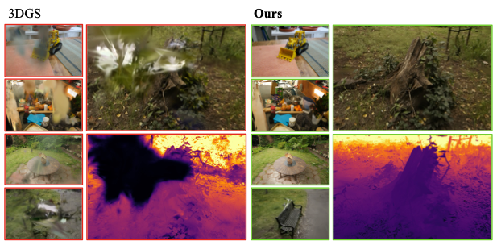

# RAIN-GS: Relaxing Accurate Initialization Constraint for 3D Gaussian Splatting
<a href="https://ku-cvlab.github.io/RAIN-GS/ "></a>
<br>

This is our official implementation of the "Relaxing Accurate Initialization Constraint for 3D Gaussian Splatting"!

by [Jaewoo Jung](https://crepejung00.github.io)<sup>:umbrella:</sup>, [Jisang Han](https://github.com/ONground-Korea)<sup>:umbrella:</sup>, [Honggyu An](https://hg010303.github.io/)<sup>:umbrella:</sup>, [Jiwon Kang](https://github.com/loggerJK)<sup>:umbrella:</sup>, [Seonghoon Park](https://github.com/seong0905)<sup>:umbrella:</sup>, [Seungryong Kim](https://cvlab.korea.ac.kr)<sup>&dagger;</sup>

:umbrella:: Equal Contribution <br>
&dagger;: Corresponding Author
## Introduction
<br>
We introduce a novel optimization strategy **RAIN-GS** for 3D Gaussian Splatting!

We show that our simple yet effective strategy consisted of **sparse-large-variance (SLV) random initialization** and **progressive Gaussian low-pass filter control** robustly guides 3D Gaussians to model the scene even when starting from random point clouds.

For further details and visualization results, please check out our [paper](https://arxiv.org/abs/) and our [project page](https://ku-cvlab.github.io/RAIN-GS/).

## Installation
We implement **RAIN-GS** above the official implementation of 3D Gaussian Splatting. <br> For environmental setup, we kindly guide you to follow the original requirements of [3DGS](https://github.com/graphdeco-inria/gaussian-splatting). 

## Training

To train 3D Gaussian Splatting with our novel strategy (**RAIN-GS**), all you need to do is:

```bash
python train.py -s {dataset_path} --exp_name {exp_name} --eval --ours
```

For dense-small-variance (DSV) random initialization (used in the original 3D Gaussian Splatting), you can simply run with the following command:
```bash
python train.py -s {dataset_path} --exp_name {exp_name} --eval --DSV
```

To train with Mip-NeRF360 dataset, you can add argument `--images images_4` for outdoor scenes and `--images images_2` for indoor scenes to modify the resolution of the input images.

## Acknowledgement

We would like to acknowledge the contributions of [3D Gaussian Splatting](https://github.com/graphdeco-inria/gaussian-splatting) for open-sourcing the official codes for 3DGS! 

## Citation
If you find our work helpful, please cite our work as:
```
```
